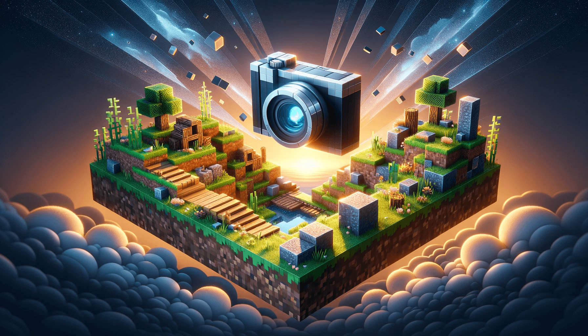

# Minecraft Screenshot Bot



Automatically capture and share your Minecraft moments! This script launches Minecraft, takes screenshots, and posts them directly to Mastodon.

## 📸 Sample Screenshots

|  |  |
| :-------------------------------------------: | :-------------------------------------------: |
|  |  |

## 🌐 See the bot running

Curious to see the bot in action? Check it out on Mastodon at [3615.computer/@CraftViews](https://3615.computer/@CraftViews/).

## 🚧 Current Status: Proof-of-Concept

As it stands, this bot serves as a basic proof-of-concept built over a week-end. While functional, automating the entire process without tying up your computer requires further optimization.

Considerations for future Enhancements:

- Exploring the possibility of using cloud instances with GPUs.
- Implementing a more dynamic path configuration instead of the current hardcoded paths based on my laptop setup.

**Additional Information:**

- The game was installed using CurseForge.
- The modpack used is `[FABRIC] Boosted FPS`, it includes various optimizations and shaders

## ⚙️ Configuration

To configure the bot, modify the **.env** file:

```
USERNAME=your_account_username
UUID=your_account_username_uuid
ACCESS_TOKEN=account_access_token
CLIENT_ID=
XUID=

SCREENSHOTS_DIR_PATH=/path/where/the/screenshots/are/saved/

MASTODON_SERVER=https://my.instance.example
MASTODON_CLIENT_ID=
MASTODON_CLIENT_SECRET=
MASTODON_ACCESS_TOKEN=
```

💡 **Pro Tip:** To simplify the configuration process, launch your Minecraft game as usual. Then, capture the command line used to run the game, for instance using `ps aux`. This will provide the exact details required for the bot's setup.
